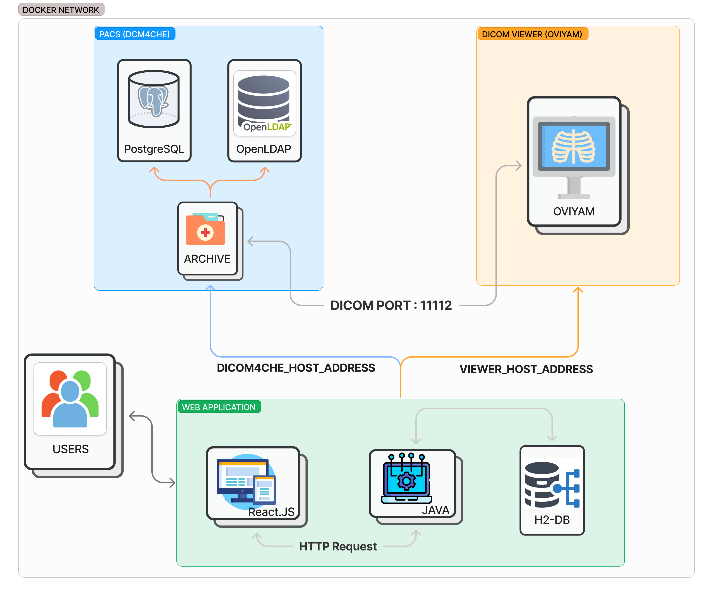
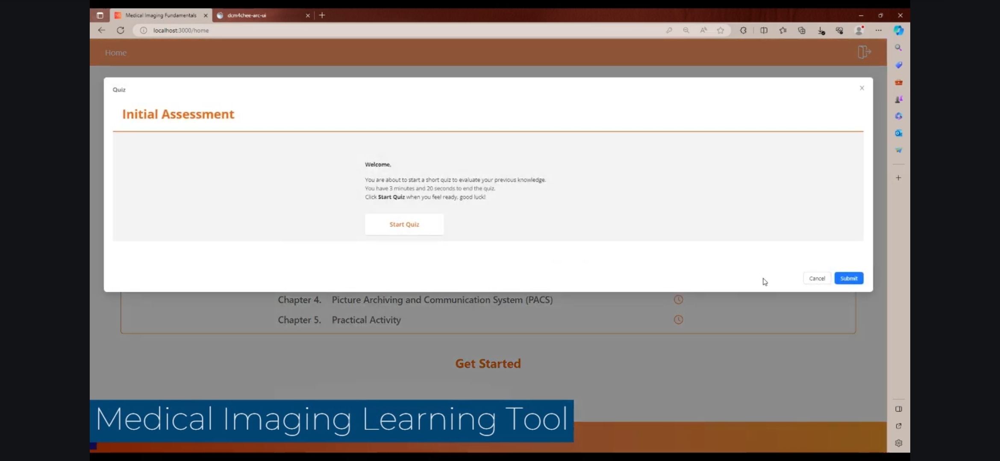
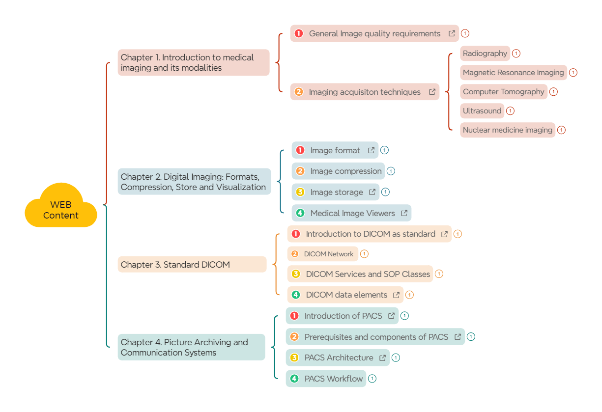

# Fundamentals of Medical Imaging Course

## Introduction:
This dockerized application encompasses an integrative Web application which provides a learning environment to
get started into the Medical Imaging Management field.

The application encompasses: 
- content from literature review
- multimedia and external links
- customised quizzes per chapter
- PACS (DICOM4CHE)
- DICOM Viewer

## Installation:

1. Build the project's image with "docker-compose up -d".
2. On the terminal from the Web App container, type "yarn start" and accept the suggested port.
3. Open the browser to localhost:3000

## Preview
### Web application

### Web Content 

